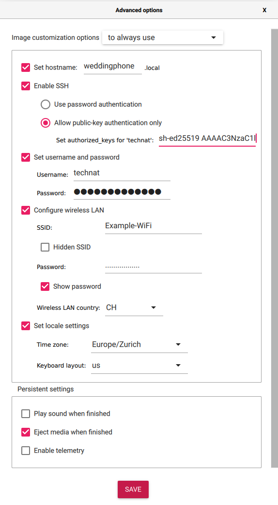

# Setup

## Flash SD card

Take an SD Card, download [rpi-imager](https://github.com/raspberrypi/rpi-imager) and flash the offical Raspberry Pi OS on the card using the following advanced options:



## Tailscale

To manage the device from everywhere I setup [tailscale](https://tailscale.com) on the device.

See [this guide](https://tailscale.com/kb/1197/install-rpi-bullseye/) for tailscale.

Switch port to 59245 in `/etc/ssh/sshd_config` for my ssh setup, so that we can `ssh weddingphone`.

## UFW

Since the device could be in any network (later on), I'd like to install a firewall:

```bash
sudo apt install ufw
sudo ufw allow 59245 # in case I ever need direct SSH access again
sudo ufw enable
```

## Dependencies

Then I install a bunch of dependencies on the device.

### Golang

The official `golang` is much out of date, therefore we install go from source:

```bash
wget https://go.dev/dl/go1.19.2.linux-arm64.tar.gz
tar -xzf go1.19.2.linux-arm64.tar.gz
sudo mv go /usr/local
echo 'export GOROOT=/usr/local/go' | sudo tee -a ~/.bashrc
echo 'export GOPATH=$HOME/go' | sudo tee -a ~/.bashrc
echo 'export PATH=$GOPATH/bin:$GOROOT/bin:$PATH' | sudo tee -a ~/.bashrc
```

### Portaudio

Should alread by installed in the newest version.

## Run

To run the software, do the following:

```bash
git clone https://github.com/the-technat/weddingphone.git 
cd weddingphone
make build
./dist/weddingphone
```